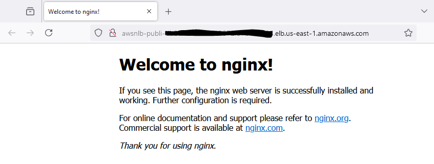

# An example of a Public Network Load Balancer (NLB) forwarding traffic to Private Application Load Balancer (ALB)

This example demonstrates how a public NLB can forward network traffic to a private ALB.

This project is developed using AWS CDK.

## What does it build?
* Creates an ECS Cluster
* Creates and deploys a NGINX Server on ECS Claster as a FARGATE_SPOT service
* Creates a Private ALB that routes traffic to ECS Service using VPC Endpoint
* Creates a Public NLB that routes traffic to ALB

## Steps to run and test
* Deploy the CDK Code. Wait for the deploy to finish.  It will print out the NLB endpoint for you to use.
  * 

## Notes:
* Convert all these to use TLS.
* If your ALB is using TLS and NLB does not, then make sure ALB has a listener for that specific non-TLS port